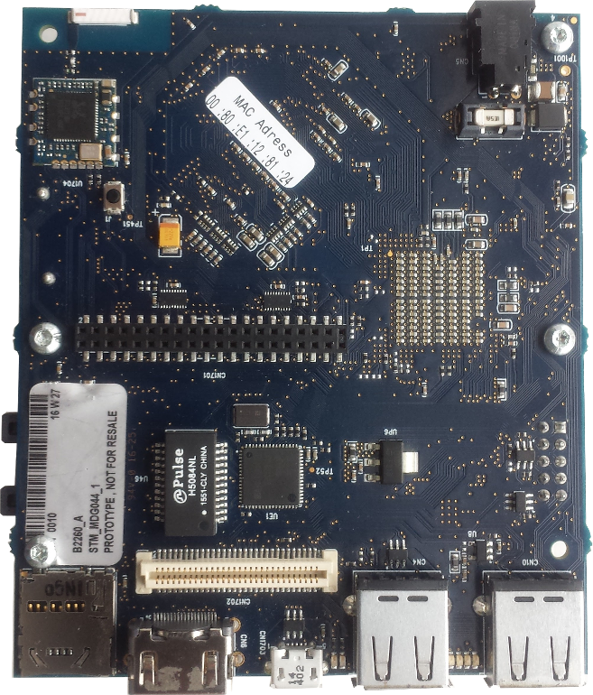
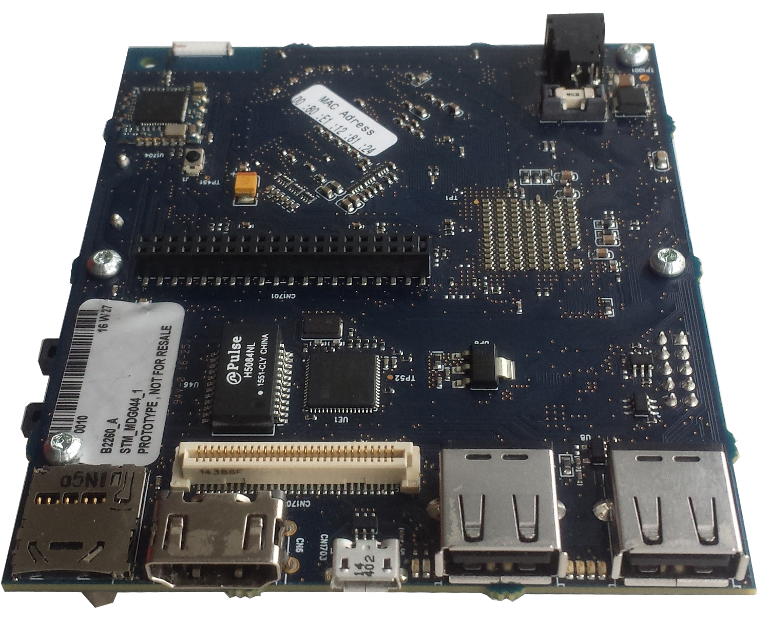
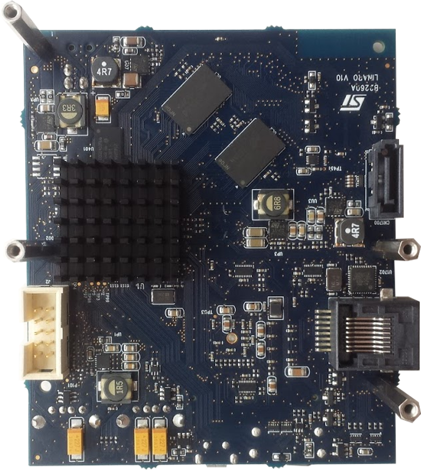

# Getting Started
Learn about your B2260 board as well as how to prepare and set up for basic use

## Setup - What you will need

**Need**
- [B2260](Insert B2260 96Boards.org landing page link here)
   - Board based on the Cannes2-STiH410 Processor
- Power Supply
   - 96Boards specifications requires a 12V / 5A Power supply ; Recommended : SUN-1200500 by SUNUP electronics.
   -  a Jack adaptor ; Recommended :  https://www.96boards.org/products/accessories/power/
- USB Keyboard and Mouse
   - With two USB-A connectors, all 96Boards can be equiped with
   a full sized AZERTY keyboard and mouse
- Monitor and HDMI Cable
   -  96Board is  equiped with a full sized HDMI connector,
   -  HDMI capable monitor or Standard TV, supported resolution up to 1080p60 is needed
- MicroSD card  
   - For booting board and for quick and easy switching between operating systems and extra storage. SDCard capacity is  2GB minimum.

**Optional**
- Ethernet cable
   - For connecting to a network without using WiFi
- 96Boards UART Adapter Board
   - For connecting to PC via serial link. Useful for debugging.
   - Recommended : https://www.96boards.org/products/mezzanine/uarts/

***
# Out of the Box
The following subsections should describe how to get started with the B2260 using the release build shipped with the boards. The B2260 board is ready to use “out of the box”  and delivered micro SDCard is populated by a preinstalled version of Debian Linux distribution.

***
## Features

|   Component          |   Description|
|:---------------------|:-------------------------------------------------------------------------------------------------|
|  SoC                 | Cannes2-STiH410 EJG|
|  CPU                 | Dual ARMcortex-A9 @ 1.5 GHz |
|  GPU                 | ARM Mali 400 GPU @ 355 MHz|
|  RAM                 | 2 x (DDR3 16-bit 500MB)|
|  PMU                 | None|
|  Storage             | MicroSD card slot , SPI NOR |
|  Ethernet Port       | Up to 1 GB|
|  Wireless            | Wi-Fi 802.11 g/n  , Bluetooth 4.0 LE|
|  USB                 | 2 x USB2.0 Host (TypeA), 1x USB3.0 DRD Salve (Type micro AB), 1 x USB 2.0 host (on high-speed expansion connector)|
|  Display             | 1 x HDMI 1.4 up to 1080p60 (TypeA)|
|  Video               | Software video codecs|
|  Audio               | outputs on HDMI and PCM/I2S (via Low-speed expansion connector)|
|  Camera              | None|
|  Expansion Interface | 40 pin Low-speed expansion connector (12 x GPIO, 1 UART 4 wires, 1 UART 2 wires, 2 x I2C, 1 PCM/I2S, 1 SPI, 1 Fan Ctrl, reset  button);  60 pin High-speed expansion connector (1x USB, 2 x I2C, 1x SPI, 1x SD interface) |
|  LED                 | 1 x WiFi activity LED（Yellow）, 1 x BT activity LED (Blue),4 x User LEDs (Green)|
|  Button              | Reset
|  Power Source        | 12V , 5A, Plug specification is inner diameter 1.7mm and outer diameter 4.8mm |
|  OS Support          | Linux based on Debian ; Linux based on OpenEmbedded|
|  Size                | 85mm x 100mm|

**IMPORTANT NOTES**

- HDMI EDID display data is used to determine the best display resolution. On monitors and TVs that support 1080p (or 1200p) this resolution will be selected. If 1080p is not supported the next available resolution reported by EDID will be used. This selected mode will work with most but not all monitors/TVs.
***

## Starting the board for the first time
Micro SDCard comes preloaded with Debian Linux and can be up and running with a few simple steps:

- Connect the B2260 to your display with the HDMI cable. It is important to do this first because the monitor will not detect the board if it is connected after starting. Ensure that the source for the display is switched to the HDMI port you are using
- Connect the USB keyboard and mouse using USB ports type A.
- Insert the populated Micro SDCard the B2260.

> Note: The above setup will cause B2260 Board to Auto Power up when it is plugged into power

- Connect the power supply to the B2260. The board will begin to boot Debian Linux after **X (to be updated)** s.

***

## Updating to a new release or change your operating system

<Do not touch this section>

If you are already familiar with the B2260 board and would like to change out the stock operating system, please proceed to one of the following pages:

- [**Downloads page**](../Downloads/README.md): This page lists all Linaro and 3rd party operating systems available for B2260
- [**Installation page**](../Installation/README.md): If you already have the images you need, this page has information on how to install the different operating systems onto your B2260 board
- [**Board Recovery**](../Installation/BoardRecovery.md)
   - If at any time your board is having unexplainable issues, it is suggested to attempt a board recovery. These instructions will guide you through a successfull board recovery.
- [**Troubleshooting**](../Troubleshooting/README.md)
   - From bug reports and current issues, to forum access and other useful resources, we want to help you find answers

Back to the [B2260 documentation home page](../README.md)
